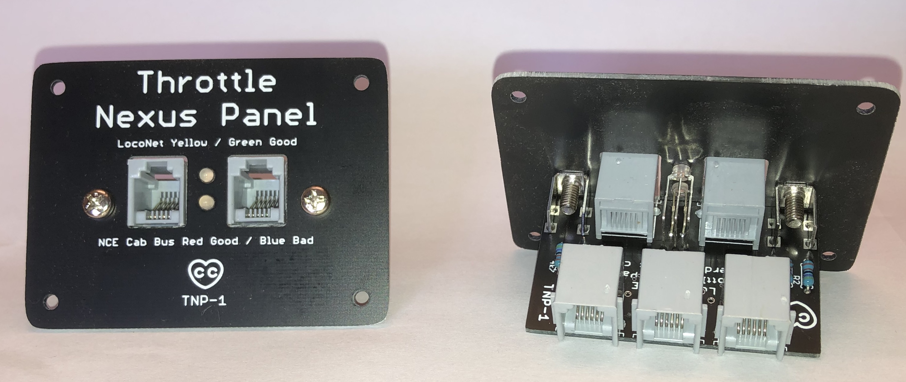
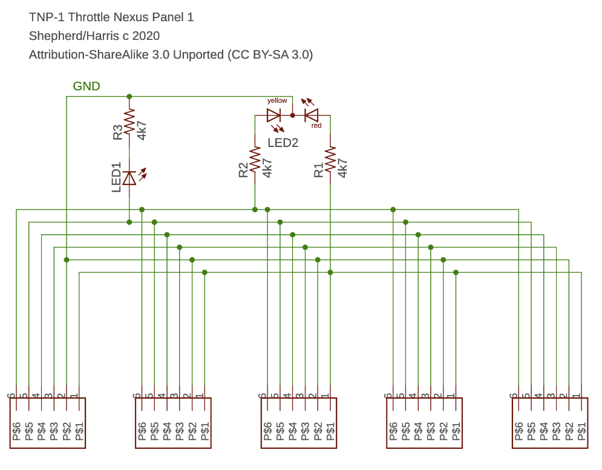
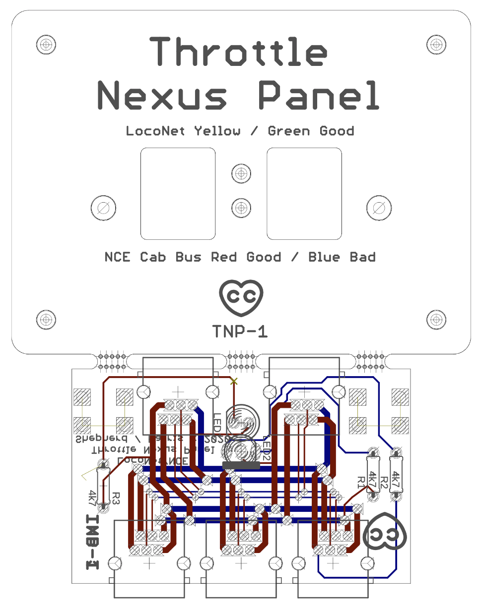

# Throttle Nexus Panel

This Eagle PCB CAD project provides an electrically neutral throttle connection panel that supports either the NCE Cab Bus or LocoNet, but not both at the same time. 

It provides 5 sockets all wired in parallel and adds some diagnostic LEDs to indicate:
- LocoNet RailSync presence indicated by the upper bi-colour Yellow/Green LED
- NCE Cable Bus Power status indicated by the lower bi-colour LED with RED for correct or "Good" polarity and Blue for reversed or "Bad" polarity. 

## Throttle Nexus Panel - Schematic

## Throttle Nexus Panel - PCB Board
A single PCB contains both the front panel with silkscreen lettering and a break-off PCB for mounting the RJ12 sockets and other components. 

This project is released under the Creative Commons Attribution ShareAlike 3.0 license (CC BY-SA 3.0)